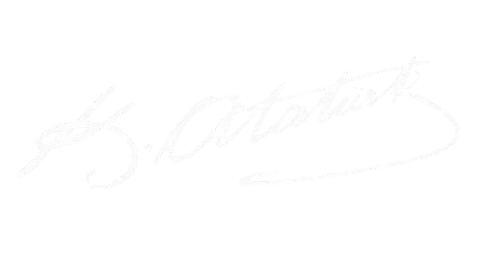

# Merhaba, ben Muharrem Emin 👋

  
  
  
  
  
  

---

## 🎮 Hakkımda

**Unreal Engine** ile oyun geliştirmeye odaklanan, hem **Blueprint** görsel programlama hem de **C++** ile aktif olarak proje üreten bir oyun geliştiricisiyim. Oyun mekaniği tasarımı, yapay zeka sistemleri ve gerçek zamanlı 3D ortamların geliştirilmesi beni en çok heyecanlandıran alanlardır.

Bunların yanında **HTML, CSS ve JavaScript** ile web projeleri geliştiriyor; iş akışlarımda **yapay zeka araçlarını** aktif olarak kullanıyorum.

- 🕹️ Ana uzmanlık: **Unreal Engine 5 — Blueprint & C++**
- 🌐 Ayrıca: **HTML · CSS · JavaScript**
- 🤖 Yapay zeka destekli geliştirme: prompt mühendisliği, araç entegrasyonu
- 📍 Türkiye
- 🔭 Üzerinde çalıştığım proje: OpenTemp ve Dream Killer
- 💬 Bana sorabileceklerin: oyun mekaniği, UE5 sistemleri, Web Sitesi Tasarımları

---

## 🛠️ Teknoloji Yığını

### 🎮 Oyun Geliştirme
| Araç | Seviye |
|------|--------|
| Unreal Engine 5 | ⭐⭐⭐ |
| Blueprint Visual Scripting | ⭐⭐⭐⭐ |
| C++ (Oyun Programlama) | ⭐⭐⭐|

### 🌐 Web
| Araç | Seviye |
|------|--------|
| HTML5 | ⭐⭐⭐⭐ |
| CSS3 | ⭐⭐⭐⭐ |
| JavaScript | ⭐⭐⭐ |

### 🤖 Yapay Zeka & Araçlar
- Prompt mühendisliği (Gemini, Claude vb.)
- Yapay zeka destekli kod üretimi ve hata ayıklama
- Geliştirme süreçlerini yapay zeka ile otomatikleştirme
---

## 🚀 Öne Çıkan Projeler

### 🌐 [OpenTemp — Clean Baseline Template](https://github.com/Kzuyaa/OpenTemp-clean_baseline)
> *C++17 + Vanilla JS ile geliştirilmiş HTML template yönetim sisteminin tema değiştirilebilir, dashboard-editable web template'i.*

- **C++17 CLI:** Batch string replacement, tema üretimi, template işleme (`std::filesystem`, `std::regex`)
- **Vanilla JS Dashboard:** Canlı önizleme, inline editor (undo/redo), 13+ CSS tema sistemi
- `template.json` field sistemi ile tüm içerik dashboard'dan düzenlenebilir
- Sıfır dependency — tarayıcıda direkt çalışır, ZIP/HTML export

---

## 📫 İletişim

---

  <i>"İyi oyunlar tesadüfen yapılmaz — tasarlanır, geliştirilir ve rafine edilir."</i>

 
 

  <i>“Zafer, "Zafer benimdir" diyebilenindir. 
  Başarı ise, "Başaracağım" diye başlayarak 
  sonunda "Başardım" diyebilenindir.’”</i> 
  — <b>Mustafa Kemal Atatürk</b> 
  

