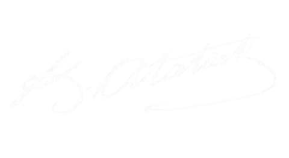

# Merhaba, ben Muharrem Emin 👋

  
  
  
  
  
  

---

## 🎮 Hakkımda

**Unreal Engine** ile oyun geliştirmeye odaklanan, hem **Blueprint** görsel programlama hem de **C++** ile aktif olarak proje üreten bir oyun geliştiricisiyim. Oyun mekaniği tasarımı, yapay zeka sistemleri ve gerçek zamanlı 3D ortamların geliştirilmesi beni en çok heyecanlandıran alanlardır.

Bunların yanında **HTML, CSS ve JavaScript** ile web projeleri geliştiriyor; iş akışlarımda **yapay zeka araçlarını** aktif olarak kullanıyorum.

- 🕹️ Ana uzmanlık: **Unreal Engine 5 — Blueprint & C++**
- 🌐 Ayrıca: **HTML · CSS · JavaScript**
- 🤖 Yapay zeka destekli geliştirme: prompt mühendisliği, araç entegrasyonu
- 📍 Türkiye
---

### 🎮 Oyun Geliştirme
| Araç | Seviye |
|------|--------|
| Unreal Engine 5 | ⭐⭐⭐ |
| Blueprint Visual Scripting | ⭐⭐⭐⭐ |
| C++ (Oyun Programlama) | ⭐⭐⭐|

---

  <i>"İyi oyunlar tesadüfen yapılmaz — tasarlanır, geliştirilir ve rafine edilir."</i>

 
 

  <i>“Zafer, "Zafer benimdir" diyebilenindir. 
  Başarı ise, "Başaracağım" diye başlayarak 
  sonunda "Başardım" diyebilenindir.’”</i> 
  — <b>Mustafa Kemal Atatürk</b> 
  

